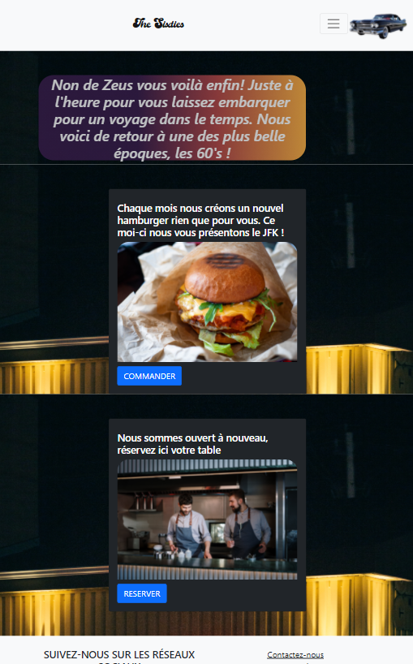
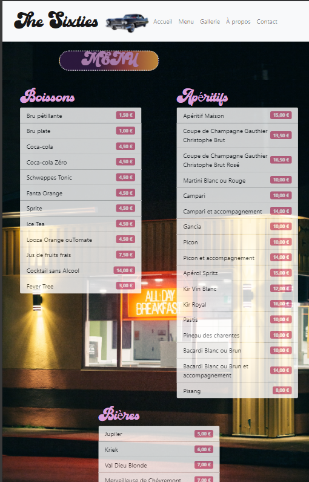
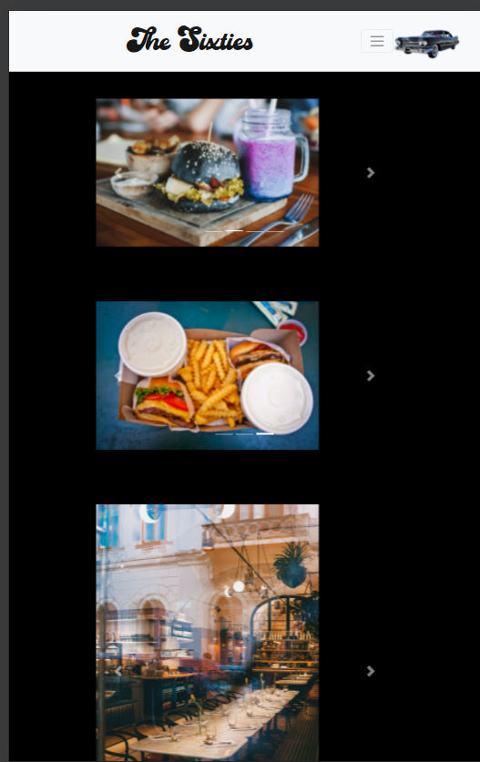
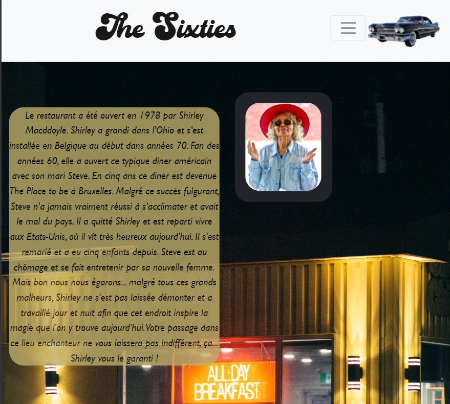
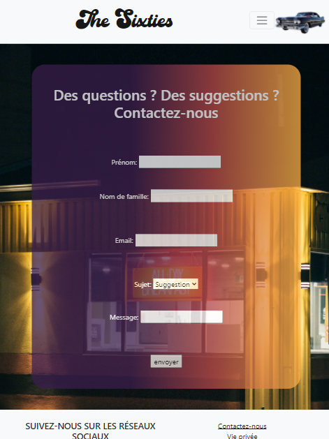

# Premier projet *Restaurant-css-framework*
Ce projet a été réalisé dans le cadre de ma formation de Web développement chez BeCode. 
Ce projet a été réalisé en solo, dans un délai de 4 jours. 

Il porte sur la création du site web d'un restaurant fictif comportant 5 pages: 

1. une page d'accueil  

1. une page de présentation du menu

1. une page gallerie photo 

 

1. une page de présentation du restaurant 

1. une page de contact 

**Les prérequis pour la réalisation de ce projet sont:**
- des connaissances des langages html et css
- des connaissances de Bootstrap

Le site est publié à l'adresse : https://morganefanon.github.io/Restaurant-css-framework/

Ou

Toutes les photos présentes dans ce projets viennent de www.pexels.com

